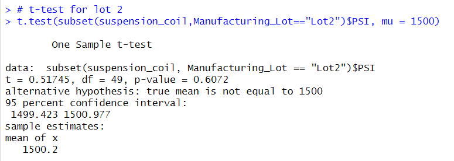

# MechaCar_Statistical_Analysis
For this analysis, I'm helping an individual by using R and statistics. The following will be completed in this analysis:
- Perform multiple linear regression analysis to identify which variables in the dataset predict the mpg of MechaCar prototypes.
- Collect summary statistics on the pounds per square inch (PSI) of the suspension coils from the manufacturing lots.
- Run t-tests to determine if the manufacturing lots are statistically different from the mean population.
- Design a statistical study to compare vehicle performance of the MechaCar vehicles against vehicles from other manufacturers. For each statistical analysis, you’ll   write a summary interpretation of the findings.

## Linear Regression to Predict MPG

Three points we can make about this summary:

1. The vehicle_length and ground_clearance are likely to provide non-random amounts of variance to the dataset. 

2. The slope of the linear model is not zero since the p-Value is at 5.35e-11 which is smaller than the assumed significance level of 0.05%.

3. This dataset would be useful because the multiple R-squared is worth 0.7159, or 71%, but we can identify other variables to add to the analysis.

## Summary Statistics on Suspension Coils

The current manufacturing data from the lot summary show that suspension coils doesnt exceed 100 pounds per square inch. However, looking deeper into the lot numbers, variance shows that lot 3 does exceed the 100 pound limit by over 70 pounds. The other lots have a a considerablly lower variance. 

## T-Tests on Suspension Coils

This is the t-test summary of all the lots and the data is similar to the suspension coils lot above. The p-value of 0.06 concludes that there is not enough
evidence to support rejecting the null hypothesis. Time  to test the individual lots to get better data.  

Lot 1 and 2 shows the true sample mean of being 1500/1500.2 and with the p-values being closer to one. This means the null hypothesis cannot be rejected.

Lot 3 shows a different story, the sample mean is 1496.14 and the p-value is .04 meaning that its lower common significance level of 0.05. This concludes to reject the null hypothesis since again, 1 and 2 are similar.

## Study Design: MechaCar vs Competition

Consumers may be interested in various parameters when comparing MechaCar to its rivals, such as price, car color, city fuel efficiency, highway fuel efficiency, horsepower, maintenance costs, or safety ratings. Here are some ways we could get better data.

* Collect data across all the major manufacturers for past couple years to test horsepower, city/highway fuel efficiency, and to check the carrying capacity for the 
suspension coils.

* Based on Mechacar, the null hypothesis is the average carrying capacity compared to the competitors carrying capacity and the alternative hypothesis is if the average carrying capacity is above or below the competitors.   

* Using a multiple linear regression statistical summary would be the best way to test since it would show data between MechaCar and the competitors.

* The safety data would be needed between Mecha cars and the competitors to sort thru this data in R. 
